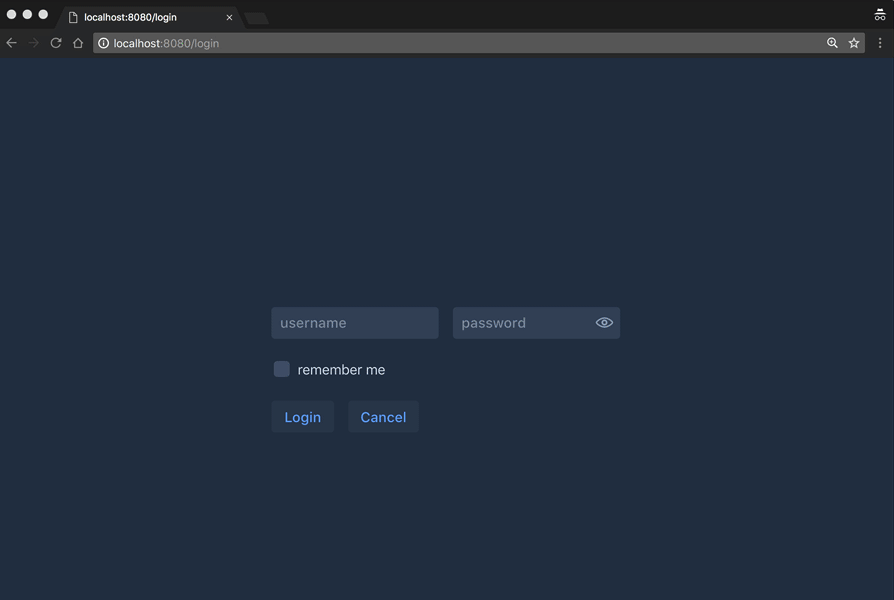

<center>
<a href="https://vaadin.com">
 </a>
</center>

# Nano Vaadin - Ramp up in a second.
A nano project to start a Vaadin project. Perfect for Micro-UIs packed as fat jar in a docker image.
This demo app is using Meecrowave and Shiro to sho a simple
approach how to combine a Security-Framework like Shiro and 
the role based navigation.

User and Password is defined in the shiro.ini file (resources - folder)

```property
[main]
authc.loginUrl = /login
vaadin = org.rapidpm.vaadin.v10.tb.demo.shiro.VaadinNavigationRolesAuthorizationFilter
vaadin.loginUrl = /login

[users]
;https://shiro.apache.org/command-line-hasher.html
admin = admin, admin
user = user, user
sven = sven, user, roleA, roleC
max = max, user, roleB


[roles]
admin = *
user = action-user:*
roleA = action-rola-a:*
roleB = action-rola-b:*
roleC = action-rola-c:*

[urls]
;FIRST MATCH WINS
/admin = authc, roles[admin]
/main = authc, roles[user]
/role-a = authc, roles[role-a]
/role-b = authc, roles[role-b]
/role-c = authc, roles[role-c]
/login = anon
/ = anon, vaadin
```

## target of this project
The target of this project is a minimal ramp up time for a first hello world.
Why we need one more HelloWorld? Well, the answer is quite easy. 
If you have to try something out, or you want to make a small POC to present something,
there is no time and budget to create a demo project.
You don´t want to copy paste all small things together.
Here you will get a Nano-Project that will give you all in a second.

Clone the repo and start editing the class ```BasicTestUI``` or ```BasicTestUIRunner```.
Nothing more. 

## How does it work?
This project will not use any additional maven plugin or technology.
The Vaadin Dependencies are all that you need to put 
a Vaadin app into a Servlet-container.

Here we are using the plain **meecrowave** as Servlet-Container.
[http://openwebbeans.apache.org/meecrowave/index.html](http://openwebbeans.apache.org/meecrowave/index.html)


As mentioned before, there is not additional technology involved.
No DI to wire all things together. 

But let´s start from the beginning.

## Start the Servlet-Container (Java)
The class ```BasicTestUIRunner``` will ramp up the Container.

Here all the basic stuff is done. The start will init. a ServletContainer at port **8080**.
If you want to use a random port, use ```randomHttpPort()``` instead of ```setHttpPort(8080);```
The WebApp will deployed as **ROOT.war**. 

```java
public class BasicTestUIRunner {
  private BasicTestUIRunner() {
  }

  public static void main(String[] args) {
    new Meecrowave(new Meecrowave.Builder() {
      {
//        randomHttpPort();
        setHttpPort(8080);
        setTomcatScanning(true);
        setTomcatAutoSetup(false);
        setHttp2(true);
      }
    })
        .bake()
        .await();
  }
}
```

After this you can start the app invoking the main-method.

## The UI itself
The UI itself is build to show you a login process and 
based on the role definition inside the file **shiro.ini**
a customized header with the navigation buttons.




Happy Coding.

if you have any questions: ping me on Twitter [https://twitter.com/SvenRuppert](https://twitter.com/SvenRuppert)
or via mail.
